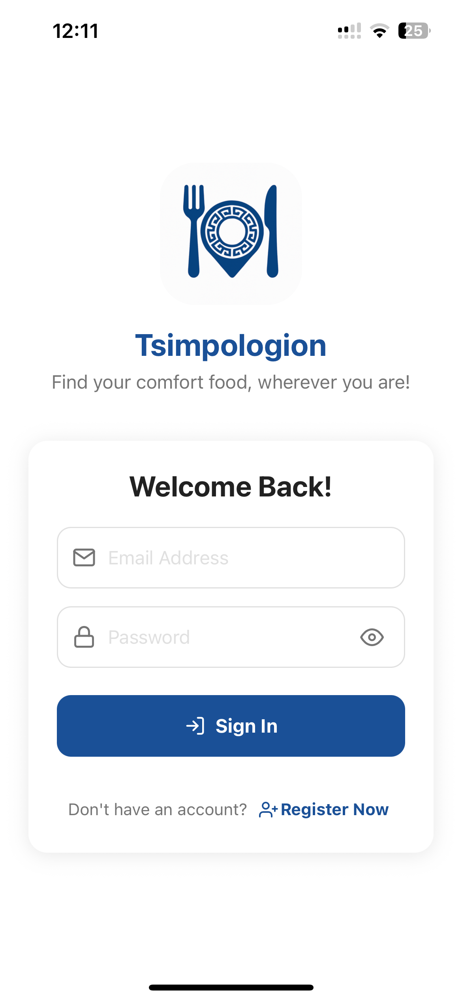
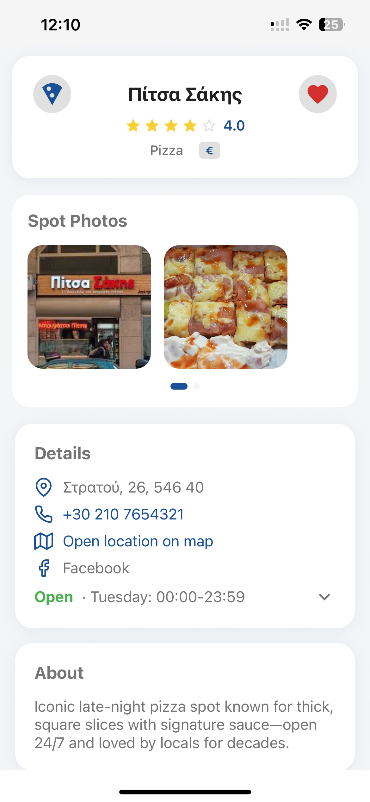
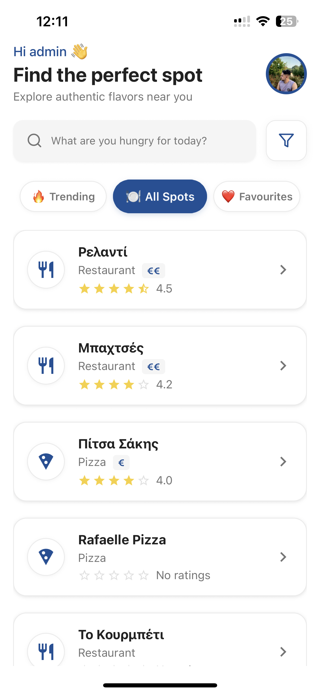
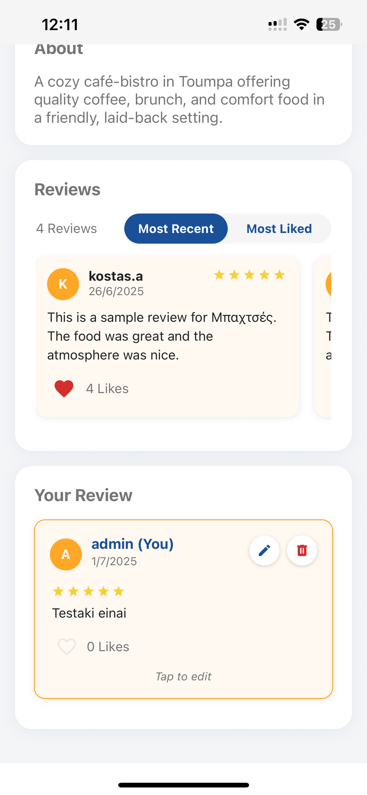
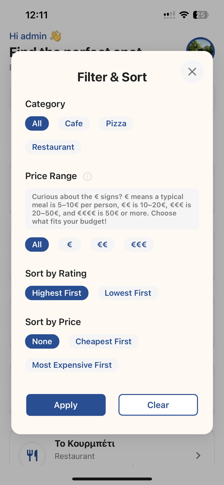
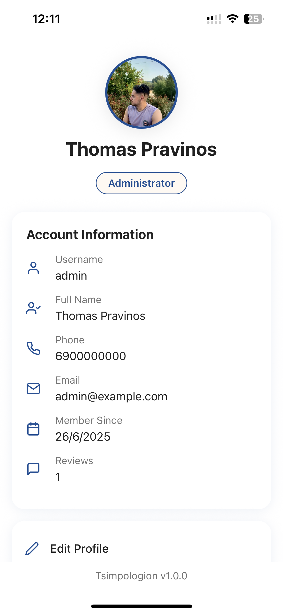

# Tsimpologion 🍽️

Discover and review food spots with a modern React Native app built using [Expo](https://expo.dev).

## Features

- **User Authentication**: Register, log in, log out, and manage your account securely
- **Profile Management**: Edit your profile, change password, upload avatar
- **Food Spot Discovery**: Browse, filter, and sort by category, rating, and location
- **Food Spot Details**: View address, business hours, contact info, social links
- **Community Reviews**: Add, edit, and delete reviews with ratings, comments, and images
- **Review Likes**: Like/unlike reviews, see like counts, sort by most liked
- **Image Uploads**: Upload images for profiles, food spots, and reviews
- **Business Hours**: Modern UI for viewing and editing business hours
- **Social Links**: Add and display social media links for food spots
- **Modern UI**: Clean, responsive design with custom components and animations
- **Fast Data Fetching**: Powered by React Query for caching and performance
- **File-based Routing**: Easy navigation using Expo Router
- **Search**: Search for food spots by name
- **Location Support**: Display and manage city/address
- **Favorites**: Mark and manage favorite food spots
- **Community Photos**: View all community-uploaded photos in a carousel
- **Error Handling**: User-friendly error and loading states
- **TypeScript Support**: Strong typing for maintainable code


## Tech Stack

**Frontend:**
- Expo (React Native framework)
- React Native
- TypeScript
- React Query
- Expo Router
- EAS (Expo Application Services)

**Backend:**
- [Laravel](https://github.com/Pravinos/tsimpologion-backend) (RESTful API, authentication, business logic)

---

## Screens Preview

Key screens in Tsimpologion:

- **Login**: Authentication for new and returning users
- **Home**: Discover trending food spots and categories
- **Food Spot Detail**: View details, business hours, reviews, and photos
- **Profile**: Manage your info, avatar, and password
- **Filter Modal**: Filter and sort food spots
- **Reviews**: Community reviews and ratings

Screenshots:

| Login | Food Spot | Home |
|:-----:|:-----:|:---------:|
|  |  |  |

| Reviews | Filter | Profile |
|:-------:|:------:|:-------:|
|  |  |  |

## Architecture

Frontend communicates with a [Laravel](https://laravel.com/) backend via RESTful API for authentication, data storage, and business logic. Ensure the backend is running and accessible for full functionality.

Backend repo: [tsimpologion-backend](https://github.com/Pravinos/tsimpologion-backend)

## Getting Started

1. **Install dependencies**
   ```bash
   npm install
   ```
2. **Start the app**
   - Development:  `$env:NODE_ENV="development"; npx expo start --clear`
   - Production:   `$env:NODE_ENV="production"; npx expo start --clear`
   - Default:      `npx expo start`
   Then choose to open in a development build, Android emulator, iOS simulator, or [Expo Go](https://expo.dev/go).
3. **Environment Configuration**
   - `.env.development` for development API endpoints
   - `.env.production` for production API endpoints
   Setting `NODE_ENV` loads the corresponding environment file automatically.
4. **Production Updates**
   ```bash
   eas update --branch main
   ```
5. **Develop**

   Edit files in the `app` directory. Routing is file-based ([docs](https://docs.expo.dev/router/introduction/)).

## 🚀 Test the App Instantly with Expo Go

You can try out Tsimpologion right now on your mobile device!

1. **Install Expo Go:**  
   Download the [Expo Go app](https://expo.dev/client) from the [App Store (iOS)](https://apps.apple.com/app/expo-go/id982107779) or [Google Play (Android)](https://play.google.com/store/apps/details?id=host.exp.exponent).

2. **Scan the QR Code Below:**  
   Open Expo Go and use its built-in QR code scanner to scan this code:

   

3. **Open the App:**  
   The app will load instantly, using the latest published update!

**Note**: For demo purposes, the app backend and database are hosted on machines with limited resources that may shut down when not used for an extended period. If the backend is down, it may take about 1 minute to start serving requests. Please be patient!


## Learn More

- [Expo documentation](https://docs.expo.dev/)
- [React Native documentation](https://reactnative.dev/)
- [Expo Router](https://docs.expo.dev/router/introduction/)


## Community

- [Expo on GitHub](https://github.com/expo/expo)
- [Expo Discord](https://chat.expo.dev)

## License

This project is provided for **portfolio and demonstration purposes only**.

All rights are reserved.  
You may **view the source code**, but you are **not permitted** to copy, modify, reuse, or distribute any part of it without explicit permission from the author.

For licensing inquiries, contact [tpravinos99@gmail.com](mailto:tpravinos99@gmail.com).

## Contact
Built by Thomas Pravinos.  
Reach me at: tpravinos99@gmail.com or [GitHub](https://github.com/Pravinos).
